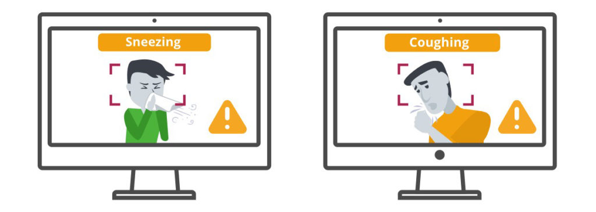
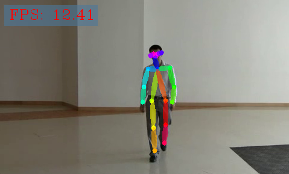
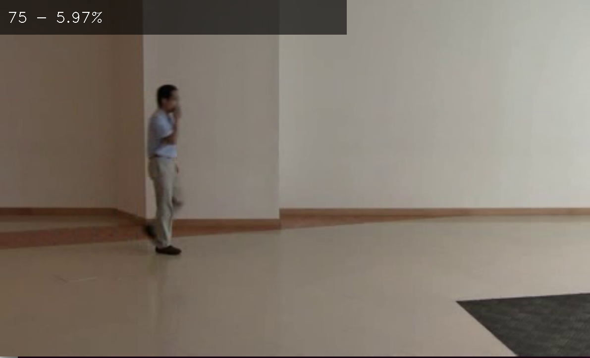

# OpenVINO_SmartCam

An AI powered Smart Camera can improve the current airport thermal scanning checkpoints for COVID-19, that function as nothing more than visual thermometers, in a number of different ways:

- **Unmanned Thermal Imaging**: current thermal scanning checkpoints need to be manned posing a staffing challenge to keep these terminals running 24/7. The screening procedure can be automated by creating models able to automatically diagnose fever.
- **Detect additional symptoms**: AI techniques can be used for detecting additional symptoms, like behavioral ‘events’ such as someone *sneezing* or *coughing*.
- **Potential spread tracking**: AI techniques can be used for keep track of contact between peoples.
- **Maintain social distancing**: AI monitoring can help identify the distances between people and the areas where paths are found that cause overcrowding.

The current focus of the project is on the detection of additional symptoms, mainly because is not involved thermal scanning and the techniques required were in part seen during the Intel Edge AI challenge course.

> [How smart thermal cameras can mitigate the spread of the Wuhan Coronavirus](https://anyconnect.com/blog/smart-thermal-cameras-wuhan-coronavirus)

## Symptoms detection

The pipeline to detect sneezing or coughing initially involved the use of pose estimation models and the creation of an additional post-processing procedure, based on some existing implementation (like discussed for example on the article [Pose-conditioned Spatio-Temporal Attention for Human Action Recognition](https://arxiv.org/pdf/1703.10106.pdf)).

>[Article: Recognizing flu-like symptoms from videos, Tuan Hue Thi et al.](https://www.researchgate.net/publication/265607317_Recognizing_flu-like_symptoms_from_videos), [Full Recognizing Flu-like Symptoms from Videos](https://web.bii.a-star.edu.sg/~chengli/FluRecognition.htm)

The result was not satisfactory, essentially because the pre-trained [Human pose estimation](https://docs.openvinotoolkit.org/latest/_models_intel_human_pose_estimation_0001_description_human_pose_estimation_0001.html) model is very different from what is required for this type of application.

We therefore opted for an implementation based on the pre-trained model of [action recognition](https://docs.openvinotoolkit.org/latest/_models_intel_action_recognition_0001_encoder_description_action_recognition_0001_encoder.html), which uses the [Kinetics-400 dataset](https://deepmind.com/research/open-source/kinetics), which unfortunately lacks coughing recognition.



For this reason, we decided on the next phase of this project, to create our own model of action recognition, using the [online guide available for OpenVINO](https://github.com/opencv/openvino_training_extensions/tree/develop/pytorch_toolkit/action_recognition), and on the Kinetics-700 dataset, which also includes coughing.

Another approach, not currently used in this project, involve the use of audio ML models for detection of sickness sounds, using dataset like the [Pfizer Digital Medicine Challenge dataset](https://osf.io/tmkud/wiki/home/) or the [Google Audioset dataset](https://research.google.com/audioset/dataset).

### Sneeze-Cough Dataset

For validate the Symptoms detection we have identified different dataset, that are currently under evaluation:

1. [BII Sneeze-Cough Human Action Video Dataset](https://web.bii.a-star.edu.sg/~chengli/FluRecognition/README.txt): A dataset for recognizing flu-like symptoms from videos, from _T. Thi, L. Cheng, L. Wang, N. Ye, J. Zhang, and S. Maurer-Stroh. Recognizing flu-like symptoms from videos. BMC Bioinformatics, 2014_.
2. [Deepmind Kinetics](https://deepmind.com/research/open-source/kinetics): A large-scale, high-quality dataset of URL links to approximately 650,000 video clips that covers 700 human action classes
3. [PETS 2006](http://www.cvg.reading.ac.uk/PETS2006/data.html): airport multi-sensor sequences containing left-luggage scenarios with increasing scene complexity.
4. [Action Recognition Datasets: "NTU RGB+D" Dataset and "NTU RGB+D 120" Dataset](http://rose1.ntu.edu.sg/datasets/actionrecognition.asp): two datasets both contain RGB videos, depth map sequences, 3D skeletal data, and infrared (IR) videos for each sample.
5. [Google AudioSet on Coughing with video](https://research.google.com/audioset/dataset/cough.html)
6. [Google AudioSet on Sneezing with video](https://research.google.com/audioset/dataset/sneeze.html)

### Preliminary test using pose estimation
images/cough-sneeze-wuhan-ai-detection.jpg?raw=true
In the following image, a frame from the proper video of the _BII Sneeze-Cough Human Action Video Dataset_ is show.


Using the pre-trained `Open Model Zoo` model _human-pose-estimation-0001_, we were able to extract the pose of the subject.



### Preliminary test using action recognition

After going through the test set looking for a good video to show in the results section, we realize that the most of them are of sneezing babies as people find that funny and share the videos of babies but there are few of old people, which makes the model kind of overfitting sneezing babies.



Using the model with the videos from BII Sneeze-Cough Human Action Dataset, the result show a very low confidence (5.97%) and a wrong action detected [75 - Country Line Dancing](https://gist.githubusercontent.com/willprice/f19da185c9c5f32847134b87c1960769/raw/9dc94028ecced572f302225c49fcdee2f3d748d8/kinetics_400_labels.csv).

# Quickstart

This tool is based on Python and OpenVINO toolkit, and this guide is focused on Ubuntu 16.04 platform, although, with some small differences, can be installed and run on different OS.

## Sneeze-Cough detection using pose estimation

The program `sneeze-cough.py` accept the following parameters:

- `-h`: show the help message and exit
- `-i I`: The location of the input file (default: 'dataset/biisc/videos/S003_M_COUG_WLK_FCE.avi')
- `-d D`: Target device: CPU, GPU, FPGA, MYRIAD, MULTI:CPU,GPU, HETERO:FPGA,CPU (default: 'CPU')
- `-m M`: The model to use ['POSE' or 'ACTION'] (default: 'POSE')
- `-t T`: Threshold value for pose parts heat map (default: 0.5)

The program can be evaluated using the following command:

```bash
python sneeze-cough.py
```

## Sneeze-Cough detection using action detection

The program `action_recognition.py` accept the following parameters:

- `-h`: Show this help message and exit.
- `-m_en M_ENCODER`: Path to encoder model
- `-m_de M_DECODER`: Path to decoder model
- `-i INPUT`: Id of the video capturing device to open (to open default camera just pass 0) or path to a video or a .txt file with a list of ids or video files (one object per line)
- `-l CPU_EXTENSION`: Absolute path to a shared library with the kernels implementation.
- `-d DEVICE`: Specify a target device to infer on. CPU, GPU, FPGA, HDDL or MYRIAD is acceptable.
- `--fps FPS`: FPS for renderer
- `-lb LABELS`: Path to file with label names

The program can be evaluated using the following command:

```bash
python3 action_recognition.py -m_en models/intel/action-recognition-0001-encoder/FP32/action-recognition-0001-encoder.xml -m_de models/intel/action-recognition-0001-decoder/FP32/action-recognition-0001-decoder.xml -i dataset/biisc/videos/S003_M_COUG_WLK_LFT.avi
```

# References

1. [Recognizing Flu-like Symptoms from Videos](https://web.bii.a-star.edu.sg/~chengli/FluRecognition.htm)
2. [Pose-conditioned Spatio-Temporal Attention for Human Action Recognition](https://arxiv.org/pdf/1703.10106.pdf)
3. [Video dataset overview](https://www.di.ens.fr/~miech/datasetviz/)
