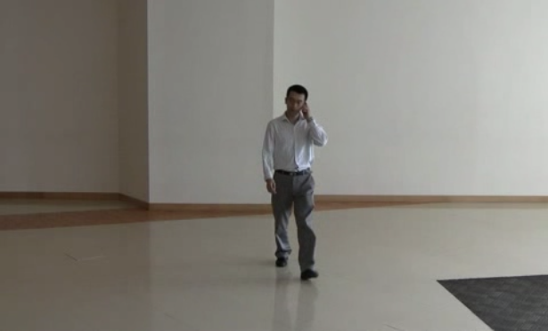

# OpenVINO_SmartCam

The aim of the project is to create an AI-powered Smart Cameras that can mitigate the spread of Wuhan Novel Coronavirus.

An AI powered Smart Camera can improve the current thermal scanning checkpoints, that function as nothing more than visual thermometers, in a number of different ways:

- **Unmanned Thermal Imaging**: current thermal scanning checkpoints need to be manned posing a staffing challenge to keep these terminals running 24/7. The screening procedure can be automated by creating models able to automatically diagnose fever.
- **Detect additional symptoms**: AI techniques can be used for detecting additional symptoms, like behavioral ‘events’ such as someone *sneezing* or *coughing*.
- **Potential spread tracking**: AI techniques can be used for keep track of contact between peoples.

The current focus of the project is on the last two point, mainly because is not involved thermal scanning and the techniques required were in part seen during the Intel Edge AI challenge course.

## Symptoms detection

The pipeline for detecting sneezing or couching involve the use of pose estimation models and the creation of an additional post-processing procedure.


### Sneeze-Couch Dataset

For validate the Symptoms detection we are evaluating two dataset:
1. [BII Sneeze-Cough Human Action Video Dataset](https://web.bii.a-star.edu.sg/~chengli/FluRecognition/README.txt): A dataset for recognizing flu-like symptoms from videos, from _T. Thi, L. Cheng, L. Wang, N. Ye, J. Zhang, and S. Maurer-Stroh. Recognizing flu-like symptoms from videos. BMC Bioinformatics, 2014_.
2. [Deepmind Kinetics](https://deepmind.com/research/open-source/kinetics): A large-scale, high-quality dataset of URL links to approximately 650,000 video clips that covers 700 human action classes

### Preliminary test

In the following image, a frame from the proper video of the _BII Sneeze-Cough Human Action Video Dataset_ is show.



Using the pre-trained `Open Model Zoo` model _human-pose-estimation-0001_, we were able to extract the pose of the subject.


## Human contact tracking

The pipeline for detecting human contact involve the use of human detection models and the creation of an additional post-processing procedure.


# Quickstart

This tool is based on Python and OpenVINO toolkit, and this guide is focused on Ubuntu 16.04 platform, although, with some small differences, can be installed and run on different OS.

## Prerequisites

Follow the original guide Install OpenVINO using the

Download the Open Model Zoo models used using the OpenVINO utility:

```bash
/opt/intel/openvino/deployment_tools/open_model_zoo/tools/downloader/downloader.py --precisions FP32 --name human-pose-estimation-0001 -o models
```

## Usage
Then, for run the application, you can use the following command:

```bash
source /opt/intel/openvino/bin/setupvars.sh

python sneeze-cough.py
```

# References

1. [How smart thermal cameras can mitigate the spread of the Wuhan Coronavirus](https://anyconnect.com/blog/smart-thermal-cameras-wuhan-coronavirus)
2. [Sneeze dataset](https://research.google.com/audioset/balanced_train/sneeze.html)
3. [Recognizing flu-like symptoms from videos](https://www.researchgate.net/publication/265607317_Recognizing_flu-like_symptoms_from_videos)
4. [Action Recognition Datasets: "NTU RGB+D" Dataset and "NTU RGB+D 120" Dataset](http://rose1.ntu.edu.sg/datasets/actionrecognition.asp)
5. [Recognizing Flu-like Symptoms from Videos Article](https://web.bii.a-star.edu.sg/archive/machine_learning/Projects/FluRecognition.htmhttps://www.researchgate.net/profile/Sebastian_Maurer-Stroh/publication/265607317_Recognizing_flu-like_symptoms_from_videos/links/5592a59a08ae1e9cb4296b96/Recognizing-flu-like-symptoms-from-videos.pdf), [Full material access here](https://web.bii.a-star.edu.sg/~chengli/FluRecognition.htm)
7. [Pose-conditioned Spatio-Temporal Attention for Human Action Recognition](https://arxiv.org/pdf/1703.10106.pdf)
